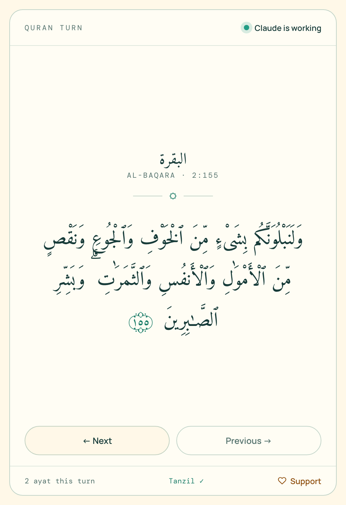
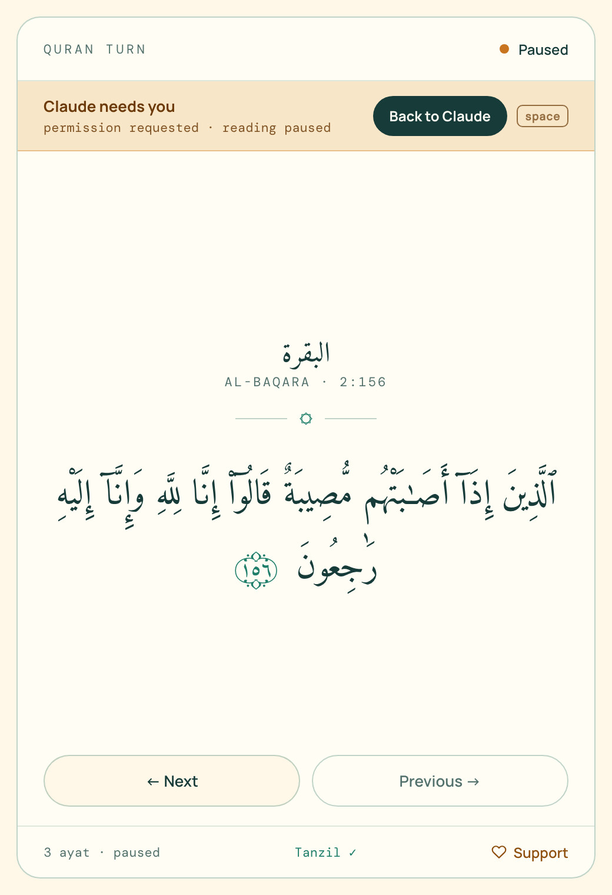
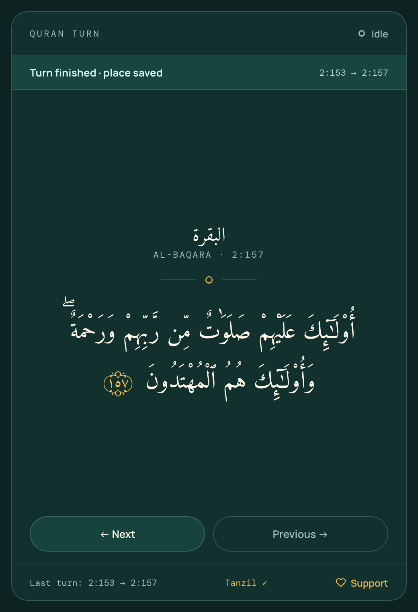

# Quran Turn

**Read the Qur'an while your coding agent thinks.**

Quran Turn is a plugin for **Claude Code** and **Codex**. When you send your agent a prompt, a quiet reader window opens at the exact ayah you left off. Press **Float** and the reader becomes a small ayah card that stays on top of every window, right beside your agent. When the agent needs you, a strip slides into the card and you go back with one press of Space. When the turn ends, your place is saved automatically.

<p align="center">
  
  
  
</p>

- **Exact Qur'an text.** It ships Tanzil's verified Uthmani text byte-for-byte and checks it by SHA-256 before a single letter renders. No code path, and no LLM, ever edits it.
- **Fully offline.** The text, fonts and reader all live on your machine. No account, sync, analytics or telemetry.
- **Knows when you're needed.** It isn't a timer: agent hooks tell it when the agent is working, waiting on you, or done.
- **Calm by design.** No streaks, XP or nag screens, just one log line per turn: where you started and where you stopped.

## Install

Requires **Node.js 18+**. There's nothing to `npm install`, because Quran Turn has zero dependencies.

### Easiest: ask your agent

Paste this into **Claude Code** (terminal, or the Code tab in the Claude desktop app):

```text
Install the Quran Turn plugin for me. In the terminal, run `claude plugin marketplace add rzrizaldy/quran-turn` and then `claude plugin install quran-turn@quran-turn`. When both succeed, tell me to restart Claude Code. If the `claude` command isn't available, tell me to type `/plugin marketplace add rzrizaldy/quran-turn` and then `/plugin install quran-turn@quran-turn` myself, one line at a time.
```

Paste this into **Codex** (CLI or the Codex app):

```text
Install the Quran Turn plugin for me. In the terminal, run `codex plugin marketplace add rzrizaldy/quran-turn` and then `codex plugin add quran-turn@quran-turn`. When both succeed, tell me to restart Codex and approve Quran Turn's hooks when it asks.
```

### Or run the commands yourself

**Claude Code:** type each line on its own (`/plugin` accepts one command at a time):

```
/plugin marketplace add rzrizaldy/quran-turn
```

```
/plugin install quran-turn@quran-turn
```

**Codex:** in your terminal:

```bash
codex plugin marketplace add rzrizaldy/quran-turn
```

```bash
codex plugin add quran-turn@quran-turn
```

Then start `codex` and approve Quran Turn's hooks when it asks. Codex never runs untrusted plugin hooks.

### From source

```bash
git clone https://github.com/rzrizaldy/quran-turn
```

```bash
claude --plugin-dir ./quran-turn
```

Then send any prompt. The reader opens as a small app window if Chrome, Edge, Brave or Chromium is installed, and in your default browser otherwise. It opens once and is reused, so later turns never open another tab.

## How it works

```
 you send a prompt ─▶ UserPromptSubmit ─▶ reader opens (or grows back) · "Claude is working" · counts ayat
                                            │
   agent asks approval ─▶ PermissionRequest ─▶ reader shrinks to a small strip · Claude comes to the front
                                            │
     you approve, tool runs ─▶ PostToolUse ─▶ reader grows back to where you were reading
                                            │
             turn ends ─▶ Stop ─▶ place saved automatically · reader shrinks · Claude comes to the front
```

- **Your place saves itself.** Every ayah you move is written to disk at once, and the Stop hook closes the turn. You never need to run a command; `quran-turn log` is only there if you're curious.
- **Back to your agent in one key.** When the agent needs you or is done, the strip shows **Back to Claude** (or Codex). Click it or press **Space**, and the app you're running the agent in (the Claude desktop app, Codex, Terminal, iTerm, VS Code…) comes to the front.
- **A side window, never full screen.** The reader opens at 460×740, shrinks to a 380×112 strip, and grows back to your size, capped so it never returns full screen. Turn the automatic shrinking off with `quran-turn switch off`. Window switching is macOS-only for now, and the first time, macOS asks to let your agent's app control your browser.
- **Hooks:** they call `bin/quran-turn hook <event>`, print nothing (agents read hook output as context), always exit 0, and take about 40 ms.
- **Reader server:** a tiny local server on `127.0.0.1:47114` serves the reader. The first hook starts it, and it exits after 30 minutes with no reader connected.
- **One hooks file for both agents:** Codex provides `CLAUDE_PLUGIN_ROOT` as an alias and also sets `PLUGIN_ROOT`, which is how Quran Turn tells the two apart.

## Float mode

Press **Float** in the reader (or the **F** key) and the reader becomes a small ayah card that stays **on top of every app**, including the Claude desktop app, Codex, Terminal and your editor. Drag it wherever you like, and it stays there.

- **While the agent works:** read with ← / →. The card never moves on its own and never steals focus.
- **When the agent needs you:** a strip slides into the card: *Claude needs you · Back to Claude*. Nothing jumps and your reading isn't cut off. Press **Space** (or Enter) when you're ready, and your agent comes to the front.
- **When the turn ends:** *Saved at 2:157 · 4 ayat* slides in. Press Space to go back, or keep reading with ←.
- **Esc** or **×** closes the card and brings the full reader back.

Float uses Chrome's Document Picture-in-Picture, so it needs **Chrome, Edge or Brave**, on macOS, Windows or Linux. Opening it takes one click or key press per session, because browsers require that for floating windows. Without Float, the reader works as a regular window, which shrinks to a strip when the agent needs you (macOS).

## Start anywhere, find anything

The first time the reader opens, it asks **where you'd like to start**. After that, press **G** (or click the counter at the bottom) to go anywhere. One search box understands:

| Type | Goes to |
|---|---|
| `2:255` | an ayah (Ayat al-Kursi) |
| `18` · `kahfi` · `yasin` · `al-mulk` · `the cave` · `الكهف` | a surah, by number, name or meaning |
| `juz 30` · `j15` | the start of a juz |
| `hal 50` · `page 604` | the start of a page in the Madani mushaf |
| `قل هو الله احد` · `الصلاة` | ayat containing those Arabic words |

There are one-tap starts for **Al-Fatihah, Juz 'Amma, Al-Kahf, Yasin and Al-Mulk**, and you can browse by **Surah** or **Juz**.

Search is forgiving. Harakat are optional, and modern spelling finds Uthmani spelling ("الصلاة" finds "ٱلصَّلَوٰةَ"). That loosening is used **only for matching**: every ayah in the results is shown exactly as Tanzil's text. The juz and page starts come straight from Tanzil's metadata.

From the terminal:

```bash
quran-turn start juz 30
```

`start` accepts anything the search box accepts: `start kahfi`, `start 2:255`, `start hal 50`.

## Updating

A new version is released automatically whenever the version number changes on `main` (see `.github/workflows/release.yml`). To get it:

- **Claude Code:** turn on auto-update for the `quran-turn` marketplace in `/plugin` → Marketplaces. Or update by hand:

  ```bash
  claude plugin marketplace update quran-turn
  ```

  ```bash
  claude plugin update quran-turn@quran-turn
  ```

- **Codex:**

  ```bash
  codex plugin marketplace upgrade quran-turn
  ```

  ```bash
  codex plugin add quran-turn@quran-turn
  ```

Restart the agent afterwards. Your reading position and log live in `~/.quran-turn` and are never touched by an update.

## Using the reader

| Key | Action |
|---|---|
| `←` `j` `space` | Next ayah while the agent works (Arabic reads right to left) |
| `space` / `enter` | **Back to Claude/Codex**, when it needs you or is done |
| `→` `k` | Previous ayah |
| `g` | **Go to / search**: surah, juz, ayah, page or Arabic words |
| `+` / `-` | Text size |
| `d` | Toggle light / dark |
| `f` | **Float**: the always-on-top ayah card |
| `esc` | Close the float card |

```
quran-turn open        open the reader window
quran-turn where       your current position        → Al-Baqara 2:157  البقرة
quran-turn start <…>   start from anywhere          → quran-turn start juz 30
quran-turn log [n]     your last n turns            → Sep 22, 8:42 PM  2:153 → 2:157  4 ayat  claude
quran-turn status      one line for a status bar    → ☾ quran-turn · Al-Baqara 2:157 · reading
quran-turn on | off    enable or pause the hooks
quran-turn switch on | off   shrink the reader when the agent needs you (macOS)
```

(From a clone, run these as `node bin/quran-turn …`.)

## Your data stays yours

Everything is plain JSON in `~/.quran-turn/` (override with `QURAN_TURN_HOME`):

| File | What's in it |
|---|---|
| `state.json` | where you are: `{"surah": 2, "ayah": 157}` |
| `agent.json` | whether the agent is working, waiting on you, or done |
| `sessions.jsonl` | one line per turn: `{"from":"2:153","to":"2:157","ayat":4,"agent":"claude", …}` |
| `config.json` | `{"enabled": true, "autoOpen": true, "autoSwitch": true}` |

Your prompts, code and anything else from your agent session are **never** stored. Delete these files whenever you like.

## Text accuracy

- **Source.** `data/quran-uthmani.txt` is the **Tanzil Quran Text (Uthmani) v1.1**, downloaded with Tanzil's default options (pause marks and sajdah signs on, rub-el-hizb off). `scripts/fetch-quran.sh` reproduces the download exactly.
- **Pinned.** `data/SHA256SUMS` pins the text, the metadata and the Qur'an font. The reader hashes the file again in the browser and **refuses to render** if it doesn't match.
- **Untouched.** Each ayah goes into the page with `textContent` only: no normalization, trimming or HTML.
- **Basmala.** Tanzil prefixes the basmala to ayah 1 of every surah except 1 and 9. The reader shows it as a header line by splitting the string, and verifies that the pieces join back to the exact original.
- **Checked in the browser.** Every one of the 6,236 ayat was stepped through in the real reader and matched the file exactly.

```bash
npm run verify           # checksums · 114 surahs · 6,236 ayat · per-surah counts · lossless basmala split
```

```bash
npm run verify:remote    # also compares every ayah's letters with a second Tanzil-derived copy
```

The remote check compares against api.alquran.cloud, which serves an older Tanzil build. All 6,236 ayat match letter-for-letter except five, and those five are exactly Tanzil's documented v1.1 corrections (2:181, 8:6 and 13:37 `بَعْدَ مَا`; 12:39 and 12:41 `يَـٰصَـٰحِبَىِ`).

Found a problem with the text itself? Please report it to [Tanzil](https://tanzil.net), which maintains it.

## Support

Quran Turn is free and will stay free: no ads, no paywall, and no Qur'an behind an account. If it has a place in your day, you can support it at **[quran.allrize.tech](https://quran.allrize.tech/#support)**:

- **In Indonesia:** QRIS, GoPay, bank transfer or card through Midtrans. Pick 5rb / 10rb / 25rb / 50rb or your own amount.
- **Elsewhere:** [pay with card through Stripe](https://buy.stripe.com/6oUaEYfkugo24pgaPx7ok01).

The desktop app never talks to a payment provider. Its Support link only opens that page.

<details>
<summary>Deploying quran.allrize.tech (Cloudflare Pages)</summary>

`site/` is a Cloudflare Pages project:

- `public/` holds the static pages.
- `functions/api/donations/` holds two small Pages Functions that create Midtrans Snap transactions server-side.

Deploy it with:

```bash
cd site && npx wrangler pages deploy
```

Set the Midtrans keys as Pages secrets, never in the repo:

```bash
npx wrangler pages secret put MIDTRANS_SERVER_KEY
```

```bash
npx wrangler pages secret put MIDTRANS_CLIENT_KEY
```

`MIDTRANS_IS_PRODUCTION` and `SITE_URL` live in `site/wrangler.toml`. Without keys, the Midtrans button shows "Pembayaran belum tersedia" and everything else keeps working.

</details>

## Development

```bash
npm test          # parser, state machine, hooks (silent + exit 0), server, donation API
```

```bash
npm start         # reader at http://127.0.0.1:47114
```

```
bin/quran-turn          CLI and hook entry point
src/                    state machine, local server, window opener
app/                    the reader (HTML/CSS/JS, bundled fonts)
data/                   Tanzil text + metadata (verbatim) and checksums
hooks/hooks.json        hook wiring for Claude Code and Codex
.claude-plugin/         Claude Code plugin + marketplace manifests
.codex-plugin/          Codex plugin manifest
site/                   quran.allrize.tech (Cloudflare Pages: public/ + functions/)
scripts/                fetch + verify the Qur'an data
test/                   node:test suites
```

Contributions are welcome. The one rule: **never modify anything in `data/`**. Tanzil's license forbids changing the text, and `npm run verify` will catch it.

## Credits & license

- **Code:** [MIT](LICENSE)
- **Qur'an text and metadata:** © [Tanzil Project](https://tanzil.net), CC BY 3.0. Distributed verbatim; changing it is not allowed. See [data/LICENSE-TANZIL.md](data/LICENSE-TANZIL.md).
- **Fonts:** [Amiri Quran](https://github.com/aliftype/amiri), Manrope and DM Mono, all under the SIL Open Font License 1.1 (`app/fonts/OFL-*.txt`).
